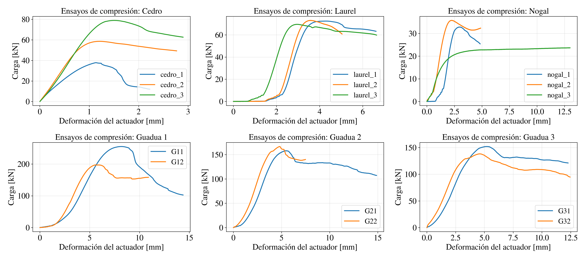
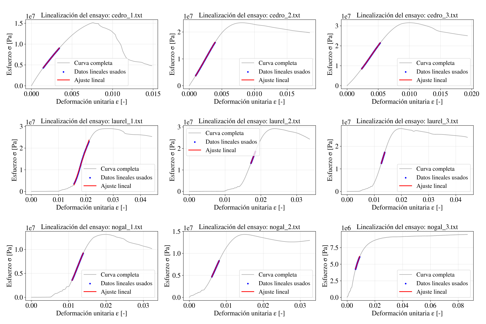

# Análisis de ensayos de compresión y Cálculo del módulo de elasticidad

Este repositorio contiene un flujo completo en **Python** para el procesamiento, análisis y visualización de resultados experimentales de **ensayos de compresión en materiales naturales** (maderas y guadua), incluyendo la identificación del rango elástico y el cálculo del **módulo de elasticidad** mediante ajuste lineal.

El código fue desarrollado y utilizado como parte del trabajo de **tesis de maestría de María José Mayorga**. Información:

- **Autora**: Maria José Mayorga Betancur.
- **Título**: Sistema modular de vivienda rural regenerativa para el
Paisaje Cultural Cafetero de Colombia basado en la
prefabricación de bahareque encementado.
- **Año**: 2026
- **Contacto**: [mmayorgab@unal.edu.co](mmayorgab@unal.edu.co)
- Universidad Nacional de Colombia.

El código permite:

- Leer archivos crudos de laboratorio.
- Calcular esfuerzo y deformación.
- Identificar automáticamente el rango elástico.
- Estimar el **módulo de elasticidad** mediante ajuste lineal.
- Generar figuras individuales y **matrices de subfiguras listas para informes técnicos**.


## Figuras generadas

A continuación se muestran las principales matrices de resultados que el código genera automáticamente.  
Estas figuras están pensadas para su inclusión directa en informes técnicos o documentos LaTeX.


### Ensayos de compresión – Curvas carga vs. deformación

Matriz de resultados experimentales de ensayos de compresión, organizada por tipo de material.  
Cada subfigura corresponde a un conjunto de probetas ensayadas bajo condiciones similares.




### Linealización de ensayos – Guadua

Identificación del tramo elástico y ajuste lineal utilizado para el cálculo del módulo de elasticidad en probetas de guadua.  
Se muestran la curva completa, los puntos usados en la linealización y la recta de ajuste.


---

### Linealización de ensayos – Maderas

Resultados de la linealización para probetas de madera (cedro, laurel y nogal).  
Cada subfigura corresponde a un ensayo individual, con su respectivo rango elástico identificado.




## Resultados numéricos obtenidos

### Módulo de elasticidad en compresión

La siguiente tabla presenta los valores del **módulo de elasticidad longitudinal $E$** obtenidos a partir de la linealización del tramo elástico de los ensayos de compresión.
Para cada material se reportan los valores individuales por probeta y el valor promedio representativo.

| Material     | Probeta / Ensayo | $E$ [GPa] |
| ------------ | ---------------- | --------- |
| **Cedro**    | cedro_1          | 2.387     |
|              | cedro_2          | 4.220     |
|              | cedro_3          | 4.426     |
|              | **Promedio**     | **3.678** |
| **Laurel**   | laurel_1         | 3.796     |
|              | laurel_2         | 4.412     |
|              | laurel_3         | 3.897     |
|              | **Promedio**     | **4.035** |
| **Nogal**    | nogal_1          | 1.930     |
|              | nogal_2          | 1.859     |
|              | nogal_3          | 0.632     |
|              | **Promedio**     | **1.473** |
| **Guadua 1** | G11              | 3.718     |
|              | G12              | 4.160     |
|              | **Promedio**     | **3.939** |
| **Guadua 2** | G21              | 3.326     |
|              | G22              | 3.659     |
|              | **Promedio**     | **3.492** |
| **Guadua 3** | G31              | 3.077     |
|              | G32              | 3.226     |
|              | **Promedio**     | **3.152** |


---

### Estimación del módulo de corte

A partir del módulo de elasticidad promedio $E$, se estimó el **módulo de corte $G$** empleando relaciones empíricas comúnmente utilizadas para materiales ortotrópicos naturales, considerando el rango:

* $G_{min}=\frac{E}{25}$
* $G_{max}=\frac{E}{16}$

La tabla siguiente resume los valores obtenidos.

| Material | $E_{prom}$ [GPa] | $G_{min}$ [GPa] | $G_{max}$ [GPa] |
| -------- | ---------------- | --------------- | --------------- |
| Cedro    | 3.678            | 0.147           | 0.230           |
| Laurel   | 4.035            | 0.161           | 0.252           |
| Nogal    | 1.473            | 0.059           | 0.092           |
| Guadua 1 | 3.939            | 0.158           | 0.246           |
| Guadua 2 | 3.492            | 0.140           | 0.218           |
| Guadua 3 | 3.152            | 0.126           | 0.197           |


## Estructura general del proyecto

```
.
├── calculo_modulos.py
├── ensayos-compresion-organizados/
│ └── *.txt
├── graficos_ensayos_compresion/
│ ├── *.png
│ └── *.pdf
├── graficos_modulos_elasticidad/
│ ├── *.png
│ └── *.pdf
└── README.md
```


## Notas técnicas

- Las figuras se exportan tanto en **PNG (300 dpi)** como en **PDF vectorial**.
- Las matrices de subfiguras se generan directamente desde el código, garantizando:
  - Consistencia gráfica.
  - Reproducibilidad.
  - Calidad adecuada para publicación.
- La rotulación `(a), (b), (c)` se deja intencionalmente fuera del código para ser gestionada en LaTeX mediante `subfigure` o `subcaption`.


## Requisitos

- Python ≥ 3.9  
- NumPy  
- Matplotlib  
- scikit-learn  
